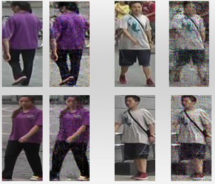

# dcgan-reid-pytorch
Using DCGAN to enhance Person-Reid's dataset

## Getting started

- Ubuntu
- NVIDIA Telsa K80
- Pytorch 0.4.1
- Python 3.6 (Anaconda3)

```
git clone https://github.com/lcylmhlcy/dcgan-reid-pytorch
cd dcgan-reid-pytorch
```

## Genereated Image
left: Original image; right: Generated image
<p>
    
</p>
